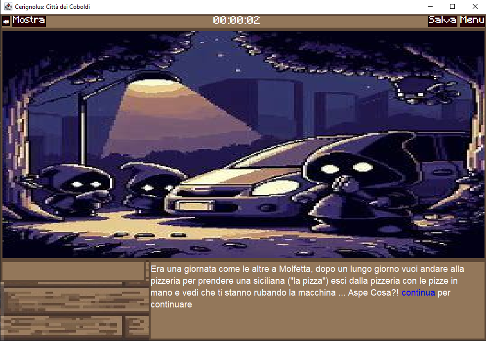

# Città dei Coboldi

## Indice

1. [**Introduzione**](#1-introduzione)
2. [**Progettazione**](#2-progettazione)
3. [**Specifiche Algebriche**](#3-specifiche-algebriche)
   - 3.1 [**Specifiche algebriche della Lista**](#31---specifica-algebrica-della-lista)
   - 3.2 [**Specifiche algebriche della Mappa**](#32---specifica-algebrica-della-mappa)
4. [**Applicazione Argomenti del Corso**](#4-applicazione-argomenti-del-corso)
   - 4.1 [**File**](#file)
   - 4.2 [**Thread**](#thread)
   - 4.3 [**Database e REST**](#database-e-rest)
   - 4.4 [**Applicazione REST e API**](#applicazione-rest-e-api)
   - 4.5 [**Lambda Expressions**](#lambda-expressions)
   - 4.6 [**Graphic User Interface**](#graphic-user-interface---swing)

# 1. Introduzione

## Cerignolus: Città dei Coboldi

Questo progetto è stato sviluppato come prova per il conseguimento del corso di **Metodi Avanzati di Programmazione**, 
che punta a formare gli studenti sulla programmazione ad oggetti e a formarsi individualmente su nuovi argomenti
richiedendone l'utilizzo per la realizzazione di questo progetto.

Nello specifico il progetto richiede la realizzazione di un'avventura prevalentemente testuale, con l'aggiunta di una **Graphic User Interface**
per la visualizzazione delle informazioni principali del gioco.

Le avventure testuali sono una tipologia di videogioco che si incentra molto sulla narrazione e sulla risoluzione di enigmi,
infatti non si disponeva di engine di grafica per la realizzazione di texture e animazioni, nonostante ciò il genere ha 
avuto grande successo e si trattava di una novità, nonché i primi passi verso ciò che abbiamo oggi come giochi di ruolo.

### Caratteristiche Principali

- **Interfaccia Testuale**: l'interazione avviene tramite comandi scritti, "prendi mantello", "ispeziona" ecc...
- **Descrizioni Dettagliate**: il gioco descrive le scene, gli oggetti e le azioni attraverso testi ed un'immagine di sfondo
- **Minigiochi**: all'interno del gioco sono presenti minigiochi come il **Blackjack** o la ricerca dei pezzi dell'**Auto**

### Trama

Ispirato ad una storia vera, il gioco comincia con il protagonista che torna nella sua casa in campagna guidando la sua macchina e la parcheggia momentaneamente fuori casa
prima di riprendere a guidare. Finito ciò che doveva fare in casa, il protagonista torna fuori e si accorge che la sua macchina stava venendo rubata da un gruppo di persone 
incappucciate. Seguendo le tracce dell'auto si ritrova in un posto sconosciuto, e appena scorge un cartello con scritto "Cerignola", un buco nel pavimento si forma sotto i suoi piedi
e sprofonda in un mondo sotterraneo e buio, ed una scritta gli appare dinanzi: "Cerignolus: Città dei Coboldi".
L'obiettivo del nostro è quello di riuscire ad uscire dalla caverna e tornare a casa riprendendosi la sua macchina ma come vedremo potrà finire in molti modi.

### Struttura del Progetto

- **Parser**: il giocatore interagisce attraverso comandi testuali che devono essere interpretati dal gioco, il parser è dunque una componente fondamentale
- **Thread**: si tratta di un progetto che ricchiede l'esecuzione contemporanea di più elementi insieme, come ad esempio il timer, la musica o il socket server
- **File di Configurazione**: il gioco include la possibiltà di salvare una partita in un dato momento, questo viene fatto serializzando gli oggetti nello stato a runtime e riportandoli in un file JSON, poi caricato per permettere di riprendere una partita da quel momento
- **Database**: il gioco registra i tempi di gioco dei giocatori ed i loro nomi su un database **H2**
- **Socket/REST**: il gioco include un server socket, sulla porta 4200 per una piccola panoramica sugli sviluppatori collegandosi all'account Github di ognuno
- **API**: il gioco per l'implementazione dei minigiochi utilizza API esterne come quella di **Deck of Cards** per il Blackjack
- **GUI**: nonostante il gioco sia testuale, è stata implementata una GUI per visualizzare le informazioni principali del gioco.

#### [Ritorna all'Indice](#indice)

# 2. Progettazione

La fase di progettazione si concentra sul definire le classi e le interazioni tra di esse, in modo da avere una visione chiara di come il progetto sarà strutturato

Nello specifico si rappresenta la parte più significativa del progetto 

## Diagramma delle Classi

Di seguito viene rappresentata la parte che gestisce la logica del videogioco, ovvero le classi che rappresentano le entità del gioco e le loro interazioni
Vengono quindi esclusi i componenti grafici, le classi di supporto e le implementazioni di minigiochi o degli argomenti esterni


Ho omesso l'implementazione di ognuna delle "AvailableRooms" e "Minigames" per non appesantire il diagramma, ma sono ovviamente presenti nel progetto

### Descrizione delle Classi

1. **Game**: Gestisce l'interazione con le stanze e i minigiochi, e la visualizzazione delle informazioni;
2. **Item**: Rappresenta un oggetto di gioco generico;
3. **Inventory**: Gestisce il denaro e un insieme di oggetti posseduti dal giocatore;
4. **Parser**: Analizza i comandi del giocatore e li redireziona al giusto manager;
5. **ParserOutput**: Contiene il comando analizzato e l'oggetto interessato;
6. **Room**: Classe astratta per definire la struttura generale di una stanza;
7. **RoomInteractionResult**: Rappresenta il risultato di un'interazione con una stanza;
8. **RoomsMap**: Tiene traccia della stanza corrente e gestisce il movimento tra stanze;
9. **RoomPath**: Gestisce i percorsi tra le stanze e la loro accessibilità;
10. **RoomInteractionResultType**: Enumera i tipi di risultati delle interazioni nelle stanze.
11. **AvailableRooms**: Collezione delle stanze disponibili nel gioco, omesse le implementazioni;
12. **MiniGame**: Classe astratta per definire il comportamento generale di un minigioco;
13. **MiniGameInteraction**: Rappresenta il risultato di un'interazione con un minigioco;
14. **MiniGameInteractionType**: Enumera i tipi di risultati delle interazioni nei minigiochi.
15. **VariousMiniGame**: Collezione dei minigiochi disponibili, omesse le implementazioni;
16. **Command**: Definisce un comando di gioco con una stringa e alias;
17. **GameCommandResult**: Rappresenta il risultato di un comando eseguito nel gioco;
18. **Time Manager**: Gestisce il tempo di gioco e la visualizzazione del tempo trascorso;

#### [Ritorna all'Indice](#indice)

## 3. Specifiche Algebriche
Due delle strutture dati più utilizzate nel nostro progetto sono la **Lista** e la **Mappa**, in questa sezione verranno presentate le specifiche algebriche di entrambe.

### 3.1 - Specifica algebrica della Lista
La lista è una struttura dati che permette di memorizzare e recuperare informazioni sfruttando l'indice di posizione degli elementi contenuti.

#### Specifica sintattica

**Tipi**
- `List`, `Element`, `Integer`, `Boolean`

**Operatori**
- `newList() -> List`: Crea una nuova lista vuota
- `add(List, Element, Integer) -> List`: Aggiunge un elemento alla lista nella posizione specificata
- `isEmpty(List) -> Boolean`: Restituisce `true` se la lista è vuota altrimenti `false`
- `getSize(List) -> Integer`: Restituisce l'ultima posizione occupata da un elemento
- `getIndex(List, Element) -> Integer`: Restituisce la posizione dell'elemento specificato
- `getElement(List, Integer) -> Element`: Restituisce l'elemento nella posizione specificata
- `remove(List, Integer) -> List`: Rimuove dalla lista l'elemento nella posizione specificata
- `contains(List, Element) -> Boolean`: Restituisce `true` se l'elemento specificato è contenuto nella lista

Si noti come `Element` è un tipo generico, che può essere sostituito con qualsiasi altro tipo di dato. `Integer` e `Boolean` invece, sono tipi ausiliari alla definizione della specifica algebrica della lista.

#### Osservazioni e Costruttori

| Metodo               | Costruttore         | Osservazioni                                                             |
|----------------------|---------------------|--------------------------------------------------------------------------|
| `isEmpty(l')`        | `newList`           | `true`                                                                   |
| `isEmpty(l')`        | `add(l, el, id)`    | `false`                                                                  |
| `getSize(l')`        | `newList`           | `error`                                                                  |
| `getSize(l')`        | `add(l, el, id)`    | `if isEmpty(l) then 1 else getSize(l) + 1`                               |
| `getIndex(l', el')`  | `newList`           | `error`                                                                  |
| `getIndex(l', el')`  | `add(l, el, id)`    | `if el = el' then id else getIndex(l, el')`                              |
| `getElement(l', id')`| `newList`           | `error`                                                                  |
| `getElement(l', id')`| `add(l, el, id)`    | `if id = id' then el else getElement(l, id')`                            |
| `remove(l', id')`    | `newList`           | `error`                                                                  |
| `remove(l', id')`    | `add(l, el, id)`    | `if id = id' then l else add(remove(l, id'), el)`                        |
| `contains(l', el')`  | `newList`           | `false`                                                                  |
| `contains(l', el')`  | `add(l, el, id)`    | `if el = el' then true else contains(l, el')`                            |

#### Specifica semantica

- **DECLARE**
  - `l`, `l'`: `List`
  - `el`, `el'`: `Element`
  - `id`, `id'`: `Integer`

- **OPERATIONS**
  - `isEmpty(newList) = true`
  - `isEmpty(add(l, el, id)) = false`
  - `getSize(add(l, el, id)) = if isEmpty(l) then 1 else getSize(l) + 1`
  - `getIndex(add(l, el, id), el') = if el = el' then id else getIndex(l, el')`
  - `getElement(add(l, el, id), id') = if id = id' then el else getElement(l, id')`
  - `remove(add(l, el, id), id') = if id = id' then l else add(remove(l, id'), el)`
  - `contains(newList, el') = false`
  - `contains(add(l, el, id), el') = if el = el' then true else contains(l, el')`

#### Specifica di restrizione

- **RESTRICTIONS**
  - `getSize(newList) = error`
  - `getIndex(newList, el') = error`
  - `getElement(newList, id') = error`
  - `remove(newList, id') = error`

### 3.2 - Specifica algebrica della Mappa
La mappa è una struttura dati che associa una chiave ad un valore, permettendo di memorizzare e recuperare informazioni in modo efficiente.

#### Specifica sintattica

**Tipi**
- `Map`, `Key`, `Value`, `Boolean`, `Integer`

**Operatori**
- `newMap() -> Map`: Crea una nuova mappa vuota
- `isEmpty(Map) -> Boolean`: Restituisce `true` se la mappa è vuota, `false` altrimenti
- `put(Map, Key, Value) -> Map`: Aggiunge una coppia chiave-valore alla mappa, o, se già presente, ne aggiorna il valore
- `get(Map, Key) -> Value`: Restituisce il valore associato alla chiave specificata
- `containsKey(Map, Key) -> Boolean`: Restituisce `true` se la chiave specificata è presente nella mappa
- `containsValue(Map, Value) -> Boolean`: Restituisce `true` se il valore specificato è presente nella mappa
- `remove(Map, Key) -> Map`: Rimuove la chiave ed il valore associato ad essa dalla mappa
- `size(map) -> Integer`: Restituisce il numero di coppie chiave-valore presenti nella mappa

#### Osservazioni e Costruttori

| Metodo               | Costruttore         | Osservazioni                                                                 |
|----------------------|---------------------|------------------------------------------------------------------------------|
| `isEmpty(m')`        | `newMap`            | `true`                                                                       |
| `isEmpty(m')`        | `put(m, k, v)`      | `false`                                                                      |
| `containsKey(m', k')`| `newMap`            | `false`                                                                      |
| `containsKey(m', k')`| `put(m, k, v)`      | `if k = k' then true else containsKey(m, k')`                                |
| `containsValue(m', v')`| `newMap`          | `false`                                                                      |
| `containsValue(m', v')`| `put(m, k, v)`    | `if v = v' then true else containsValue(m, v')`                              |
| `get(m', k')`        | `newMap`            | `error`                                                                      |
| `get(m', k')`        | `put(m, k, v)`      | `if k = k' then v else get(m, k')`                                           |
| `remove(m', k')`     | `newMap`            | `error`                                                                      |
| `remove(m', k')`     | `put(m, k, v)`      | `if k = k' then m else put(remove(m, k'), k, v)`                             |
| `size(m')`           | `newMap`            | `0`                                                                          |
| `size(m')`           | `put(m, k, v)`      | `if isEmpty(m) then 1 else size(m) + 1`                                      |

#### Specifica semantica

- **DECLARE**
  - `m`, `m'`: `Map`
  - `k`, `k'`: `Key`
  - `v`, `v'`: `Value`

- **OPERATIONS**
  - `isEmpty(newMap) = true`
  - `isEmpty(put(m, k, v)) = false`
  - `containsKey(newMap, k') = false`
  - `containsKey(put(m, k, v), k') = if k = k' then true else containsKey(m, k')`
  - `containsValue(newMap, v') = false`
  - `containsValue(put(m, k, v), v') = if v = v' then true else containsValue(m, v')`
  - `get(put(m, k, v), k') = if k = k' then v else get(m, k')`
  - `remove(put(m, k, v), k') = if k = k' then m else put(remove(m, k'), k, v)`
  - `size(newMap) = 0`
  - `size(put(m, k, v)) = size(m) + 1`

#### Specifica di restrizione

- **RESTRICTIONS**
  - `get(newMap, k') = error`
  - `remove(newMap, k') = error`


#### [Ritorna all'Indice](#indice)

# 4. Applicazione Argomenti del Corso

## File

I file sono il modo attraverso il quale il calcolatore salva i dati in modo permanente, permettendo di memorizzare grandi quantità di dati e di accederci e scriverci

In Java, i file sono gestiti attraverso la classe Files, che fornisce metodi per la gestione dei file

Nel nostro caso i file vengono utilizzati per salvare e caricare le partite, i tempi di gioco e le informazioni sui giocatori
così da permettere ai giocatori di salvare una partita che si vuole lasciare in sospeso e riprenderla in seguito

Nella fattispecie è stato usato il formato **JSON** per salvare i dati, in quanto è un formato molto flessibile e leggibile, e permette di salvare oggetti complessi in modo semplice,
inoltre l'interazione con la classe "gson" permette di serializzare e deserializzare gli oggetti in modo molto semplice

### Applicazione

- Per la riproduzione della musica
- Per serializzare gli oggetti importanti all'interno del gioco, come l'inventario, le stanze e gli oggetti, si utilizza il seguente metodo:
```java
public static void serialize(Game game, String time) {
        Gson gson = new GsonBuilder()
                .registerTypeAdapter(Room.class, new RoomDeserializer())
                .registerTypeAdapter(Item.class, new ItemDeserializer())
                .create();

        GameState gameState = new GameState(game.getInventory(), time, game.getCurrentRoomMap());
        String json = gson.toJson(gameState);
        String filePath = "src/main/resources/saves/" + game.getPlayerName() + "-" + (GameSave.getNumberOfUserSave(game.getPlayerName()) + 1) + ".json";

        try {
            Files.write(Paths.get(filePath), json.getBytes());
        } catch (IOException e) {
            throw new RuntimeException(e);
        }
    }
```

- Per deserializzare il file json riportando gli oggetti nello stato in cui si trovavano al momento del salvataggio, si utilizza il seguente metodo:
```java
public static GameState deserialize(Path filePath) {
        try {
            String json = new String(Files.readAllBytes(filePath));
            Gson gson = new GsonBuilder()
                    .registerTypeAdapter(Room.class, new RoomDeserializer())
                    .create();
            
            return gson.fromJson(json, GameState.class);
        } catch (IOException e) {
            throw new RuntimeException("Error during JSON reading", e);
        }
    }
```

Sono stati utilizzati dei GsonBuilder() per registrare dei deserializzatori
personalizzati per le classi Room e Item che sono costruiti nel seguente modo

```java
@Override
public Room deserialize(JsonElement jsonElement, Type type, JsonDeserializationContext jsonDeserializationContext) throws JsonParseException {
        JsonObject jsonObject = jsonElement.getAsJsonObject();

        String roomName = jsonObject.get("name").getAsString();
        Class roomClass = Room.class;

        switch (roomName) {
            case "corridoio" -> roomClass = HallwayRoom.class;
            case "circuito" -> roomClass = CircuitRoom.class;
            case "fucine" -> roomClass = ForgeRoom.class;
            case "palazzo" -> roomClass = PalaceEntryRoom.class;
            case "generatore" -> roomClass = PowerHouseRoom.class;
            case "taverna" -> roomClass = PubRoom.class;
            case "spiazzale" -> roomClass = SquareRoom.class;
            case "caverna" -> roomClass = StartingRoom.class;
            case "trono" -> roomClass = ThroneRoom.class;
        }

        return jsonDeserializationContext.deserialize(jsonElement, roomClass);
    }
    
@Override
public Item deserialize(JsonElement jsonElement, Type type, JsonDeserializationContext jsonDeserializationContext) throws JsonParseException {
  JsonObject jsonObject = jsonElement.getAsJsonObject();

  String itemName = jsonObject.get("name").getAsString();
  Class itemClass = Item.class;

  switch (itemName) {
    case "birre" -> itemClass = Beers.class;
    case "carrozzeria" -> itemClass = CarBody.class;
    case "mantello" -> itemClass = Cloak.class;
    case "motore" -> itemClass = Engine.class;
    case "maglio" -> itemClass = FireMaul.class;
    case "GinMoncello" -> itemClass = GinMoncello.class;
    case "volante" -> itemClass = SteeringWheel.class;
  }

  return jsonDeserializationContext.deserialize(jsonElement, itemClass);
}
```

Implementando l'interfaccia JsonDeserializer e usando questi metodi nel TypeAdapter che permette di distinguere e trattare in modo diverso gli oggetti che Gson tratterebbe come uguali

Ci siamo inoltre serviti di una classe che contenesse lo stato del gioco in un dato momento **GameState** e di una classe che gestisce la comunicazione coi file **GameSave**
così da poter accedere ad informazioni utili quali il nome dei salvataggi o il numero di salvataggi di un determinato giocatore

#### [Ritorna all'Indice](#indice)

## Thread

I thread sono utilizzati per eseguire operazioni in modo concorrente, permettendo di sfruttare al massimo le risorse del sistema e di migliorare le prestazioni delle applicazioni.
La classe thread di Java implementa tutte le funzionalità di un singolo thread e può essere creata in due modi:

- Estendendo la classe Thread, che prevede l'implementazione del metodo run() che contiene il codice da eseguire nel thread.
- Implementando l'interfaccia Runnable, che prevende anch'essa il metodo run().
A prescindere dal metodo utilizzato, il thread deve essere avviato chiamando il metodo start(), che avvia l'esecuzione del thread e chiama il metodo run().

Il thread può essere interrotto chiamando il metodo interrupt(), che invia un segnale di interruzione al thread, che può essere catturato e gestito nel metodo run().

### Applicazione 

Nel nostro progetto abbiamo utilizzato i thread per gestire il timer di gioco, la musica di sottofondo e il server socket.

- **UtilMusic**: Per permettere all'applicazione di riprodurre la musica di sottofondo in modo concorrente, è stata creata una classe che estende Thread e che implementa il metodo run() per gestire la riproduzione della musica.

```java
public class UtilMusic extends Thread {
  public void run() {
        try {
                AudioInputStream stream = AudioSystem.getAudioInputStream(new File("src/main/resources/music/Gegagedigedagedago.wav"));
                clip = AudioSystem.getClip();
                clip.open(stream);
                clip.addLineListener(event -> {
                        if (event.getType() == LineEvent.Type.STOP && !isMuted) {
                                clip.setFramePosition(0);
                                playClip();
                        }
                });
                playClip();
        } catch (UnsupportedAudioFileException e) {
                System.err.println("Unsupported audio file: " + e.getMessage());
        } catch (IOException e) {
                System.err.println("I/O error: " + e.getMessage());
        } catch (LineUnavailableException e) {
                System.err.println("Line unavailable: " + e.getMessage());
        }
  }
}
```


Qui viene gestita la comunicazione con un file di musica, che viene riprodotto in loop finché il gioco è in esecuzione.

- Nelle prossime applicazioni verranno usate insieme alle **lambda expressions** che approndiremo più avanti

- **Timer**: Il timer deve effettuare calcoli e aggiornamenti ogni secondo, per questo è stato utilizzato un thread che esegue un ciclo while che aggiorna il tempo di gioco nella GUI ogni secondo.
prendendo informazioni dalla classe **TimeManager** che gestisce il tempo di gioco
```java
public synchronized void tickTime(Game game) {
        new Thread(() -> {
            while (isGameRunning) {
                timerLabel.setText(" " + game.getTimeManager().getTime() + " ");

                try {
                    Thread.sleep(1000);
                } catch (InterruptedException e) {
                    throw new RuntimeException(e);
                }
            }
        }).start();
    }
```

**synchronized** è stato utilizzato per evitare che più thread accedano contemporaneamente alle stesse risorse

#### Socket code
- **Socket Server**: Il server socket è stato implementato in un thread a parte, che rimane in ascolto di richieste di connessione da parte dei client, e crea un thread dedicato per ogni client che si connette.
```java
public static void startServerA() {
        new Thread(() -> {
            try {
                ServerSocket serverSocket = new ServerSocket(PORT_A, MAX_USERS);
                System.out.println("SERVER STARTED at http://localhost:" + PORT_A);

                while (true) {
                    Socket socket = serverSocket.accept();
                    HttpPage page = new HttpPage(socket);

                    page.renderPage(new File("src/main/java/org/uniba/kobold/socket/page.html"));
                }

            } catch(IOException ex){
                System.out.println("CANNOT START SERVER AT PORT: " + PORT_A);
            }
        }).start();
    }
```

[*Torna ai socket*](#socket)


Sia per il server A che B

- **REST**: Il server REST è stato implementato anch'esso in un thread similarmente al socket server
```java
public static void startServer() {
        URI baseUri = UriBuilder.fromUri("http://localhost/").port(PORT).build();

        HttpServer server = GrizzlyHttpServerFactory.createHttpServer(baseUri, getControllers());

        new Thread(() -> {
            try {
                server.start();
                System.out.println(String.format("SERVER STARTED at http://localhost:%d", PORT));

                System.in.read();
                server.shutdown();
            } catch (IOException ex) {
                Logger.getLogger(Server.class.getName()).log(Level.SEVERE, null, ex);
            }
        }).start();

    }
```

Infine per il la gestione della GUI è stato usato un concetto fondamentale per l'esecuzione degli eventi sull'interfaccia in modo concorrente, ovvero l'**Event Dispatch Thread**,
attraverso l'uso di **SwingUtilities.invokeLater()** che permette di eseguire un'azione sull'interfaccia in modo concorrente o ritardandone l'esecuzione a un momento sicuro

```
SwingUtilities.invokeLater(() -> {
    progressBar.setValue(progress);
    progressBar.setString("Loading..." + progress + "%");
});
```

#### [Ritorna all'Indice](#indice)

## Database e REST

**REST** è un'architettura software che definisce un insieme di vincoli per la progettazione di servizi web che non utilizza sessioni ma si basa sulla trasmissione di dati tramite HTTP 
e che permette di accedere e modificare le risorse tramite operazioni CRUD.
REST prevede una struttura delle URI ben definita che identifica univocamente una risorsa o un insieme di risorse
Caratteristiche:
- Client-Server
- Stateless: Non vengono memorizzati i contesti, viene tutto fatto tramite richieste
- Cacheable: I client possono mettere in cache le risposte
- Layered System: Realizzato a strati potendo gestire applicazioni diverse su server a livelli diversi 
- Uniform Interface: Le risorse sono identificate tramite URI e le operazioni sono standard (GET, POST, PUT, DELETE)

**Database**: Parte automatizzata di un sistema informativo che memorizza grandi quantità di dati in maniera efficiente e sicura, viene gestito da un DBMS(DataBase Management System)
e permette di accedere e modificare i dati

Nel nostro caso abbiamo adoperato il database H2 poiché può essere utilizzato "embedded" senza dover installare un server a parte e utilizzando lo standard JDBC

JDBC è indipendente dal database e fornisce un driver manager che gestisce dinamicamente tutti gli oggetti driver di cui hanno bisogno le interrogazioni a database, quindi:

Se si hanno tre diversi DBMS allora necessiteranno tre diversi tipi di oggetti driver.
JDBC è nato per semplificare tutte le interazioni con il database

### Applicazione Database e CRUD

Il database si occupa di memorizzare i tempi di gioco dei giocatori e i loro nomi.
L'abbiamo gestito implementando una CRUD Interface:
- *Create*: per inserire un nuovo record
- *Read*: per leggere i record
- *Update*: per aggiornare un record
- *Delete*: per eliminare un record

Più nello specifico, abbiamo utilizzato *Service* e *Repository* per gestire le query al database, infatti solo Repository comunica con il database,
Service si occupa di definire l'interfaccia tra il Record e il Repository e infine il *Controller* gestisce le richieste e risposte.

Il risultato sarà una pagina nell'app che, comunicando con il database prende i record e li visualizza


//TODO: Aggiungere immagine record con effettivi record

- CRUD Interface:
```java
public interface CRUDInterface<T> {
    T save(T entity);

    int deleteById(int id);

    T updateById(T entity, int id);

    T getById(int id);
}
```
- Server: 
```java
public class Server {

    private static final int PORT = 8000;

    public static void startServer() {
        URI baseUri = UriBuilder.fromUri("http://localhost/").port(PORT).build();

        HttpServer server = GrizzlyHttpServerFactory.createHttpServer(baseUri, getControllers());

        new Thread(() -> {
            try {
                server.start();
                System.out.println(String.format("SERVER STARTED at http://localhost:%d", PORT));

                System.in.read();
                server.shutdown();
            } catch (IOException ex) {
                Logger.getLogger(Server.class.getName()).log(Level.SEVERE, null, ex);
            }
        }).start();

    }

    private static ResourceConfig getControllers() {
        ResourceConfig config = new ResourceConfig(new Class[] {
            RecordController.class
        });

        return config;
    }

}

```
- Esempio di connessione al database:

```java
public static Connection getConnection() {
  if (connection == null) {
    synchronized (DBConnection.class) {
      if (connection == null) {
        try {
          connection = DriverManager.getConnection(JDBC_URL, USERNAME, PASSWORD);
        } catch (SQLException e) {
          e.printStackTrace();
        }
      }
    }
  }
  return connection;
}
```
- Esempio di record e creazione tabella:

```java
public Record(String name, long time, int id) {
  this.id = id;
  this.name = name;
  this.time = time;
}

public RecordRepository() {
  RELATION = "records";

  String createTableSQL = "CREATE TABLE IF NOT EXISTS records (" +
          "id INT AUTO_INCREMENT PRIMARY KEY, " +
          "name VARCHAR(255)," +
          "time BIGINT" +
          ")";
  try (Statement statement = connection.createStatement()) {
    statement.execute(createTableSQL);
  } catch (SQLException e) {
    e.printStackTrace();
  }
}
```

- Per effettuare una query:

```java
//Controller
@PUT
@Path("/{recordId}")
@Produces("application/json")
public Response updateById(String json, @PathParam("recordId") String recordId) {
  Record record = recordService.updateById(gson.fromJson(json, Record.class), Integer.parseInt(recordId));

  String jsonString = gson.toJson(record);

  if(record == null) {
    return Response.status(Response.Status.NOT_FOUND).build();
  } else {
    return Response.ok(jsonString, MediaType.APPLICATION_JSON).build();
  }
}

//Repository
public Record updateById(Record entity, int id) {
  try {
    String sql = "UPDATE "+ RELATION + " SET name = ?, time = ?" + " WHERE ID = ?";
    PreparedStatement preparedStmt = connection.prepareStatement(sql, new String[]{ "ID" });

    preparedStmt.setString(1, entity.getName());
    preparedStmt.setLong(2, entity.getTime());

    int executedSt = preparedStmt.executeUpdate();

    return executedSt == 1 ? this.getInsertedOne(preparedStmt) : null;
  } catch (SQLException e) {
    return null;
  }
}
```

È sempre bene utilizzare dei **prepared statement** quando si comunica con il DB,
ovvero modello precompilato di una query SQL che può essere eseguito ripetutamente con diversi parametri.
Questo modello viene inviato al database una volta e può essere eseguito molte volte con diversi valori di parametri, 
senza la necessità di ricompilare la query ogni volta.

Questo rende la comunicazione più sicura contro SQL Injection e più efficiente per l'unica compilazione.

#### [Ritorna all'Indice](#indice)

## Applicazione REST e API
Il REST server è utilizzato per gestire le richieste HTTP e comunicare con il database, permettendo di effettuare operazioni CRUD sui record dei giocatori viste prima

Inoltre è utilizzato per effettuare chiamate alle API per implementare dei minigiochi all'interno del gioco come il Blackjack e il Trivia

- Blackjack: [Deck of Cards API](https://www.deckofcardsapi.com/)


- Richiesta GET all'API Deck of Cards

```java
private static String getRequest(String url) throws HttpInternalServerErrorException, HttpNotFoundException, HttpUnavailableException, HttpBadRequestException, HttpForbiddenException {
    // Create a new client and initiate a request
    Client client = ClientBuilder.newClient();
    WebTarget target = client.target(url);
    int status;
    String responseBody;

    // verify the response status code and handle it accordingly
    // if the status code is not 200, throw a runtime exception
    // otherwise, return the response body
    try {
        Response resp = target.request(MediaType.APPLICATION_JSON).get();
        responseBody = resp.readEntity(String.class);
        status = resp.getStatus();
    }catch (Exception e){
        throw new RuntimeException("Failed to make request to " + url, e);
    }

    HttpRequestHandler.handle(status);

    return responseBody;
}
```

- Chiamata a un numero dato di carte:
```Java
public List<Card> getCards(int numberOfCards) throws HttpInternalServerErrorException, HttpNotFoundException, HttpUnavailableException, HttpBadRequestException, HttpForbiddenException {

    // if the number of remaining cards is less than the limit, shuffle the deck
    if (remainingCards < LIMIT )shuffleDeck();

    // get a number of cards from the deck and return them as a list of Card objects
    String url = "https://www.deckofcardsapi.com/api/deck/" + deckToken + "/draw/?count=" + numberOfCards;
    Type type = new TypeToken<List<Map<String, Object>>>(){}.getType();
    Gson gson = new Gson();

    Map<String,Object> response = deserializeFromUrl(url);
    String remaining = response.get("remaining").toString();
    remainingCards = Integer.parseInt(remaining.substring(0, remaining.length() - 2));

    return gson.fromJson(gson.toJson(response.get("cards")), new TypeToken<List<Card>>() {}.getType());
}
```

- Trivia: Un piccolo quiz all'interno del gioco [Open Trivia DB](https://opentdb.com/)

- Richiesta:
```java
private static String getRequest(String url) throws HttpInternalServerErrorException, HttpNotFoundException, HttpUnavailableException, HttpBadRequestException, HttpForbiddenException {
  // Create a new client and initiate a request
  Client client = ClientBuilder.newClient();
  WebTarget target = client.target(url);
  int status;
  String responseBody;

  // verify the response status code and handle it accordingly
  // if the status code is not 200, throw a runtime exception
  // otherwise, return the response body
  try {
    Response resp = target.request(MediaType.APPLICATION_JSON).get();
    responseBody = resp.readEntity(String.class);
    status = resp.getStatus();
  }catch (Exception e){
    throw new RuntimeException("Failed to make request to " + url, e);
  }

  HttpRequestHandler.handle(status);

  return responseBody;
}
```

- Ottenimento della domanda con le possibili risposte:
```java
public static Quiz getTrivia() throws HttpInternalServerErrorException, HttpNotFoundException, HttpUnavailableException, HttpBadRequestException, HttpForbiddenException {
  String responseBody = getRequest("https://opentdb.com/api.php?amount=6&category=11&difficulty=easy");

  Gson gson = new Gson();

  return gson.fromJson(responseBody, Quiz.class);
}
```

**Entrambi** i servizi restituiscono oggetti che poi vengono gestiti attraverso la logica del gioco che viene implementata

Esempio di utilizzo dell'oggetto richiesto per il Trivia

```java
public List<List<String>> getAnswersShuffled() {
  List<List<String>> answers = new ArrayList<>();
  for( Result result : quiz.getResults()) {
    List<String> answersList = new ArrayList<>();
    answersList.add(result.getCorrectAnswer());
    answersList.addAll(result.getIncorrect_answers());
    Collections.shuffle(answersList);
    for(String answer : answersList) {
      if(answer.equals(result.getCorrectAnswer())) {
        isCorrect[quiz.getResults().indexOf(result)] = answersList.indexOf(answer);
      }
    }
    answers.add(answersList);
  }

  return answers;
}
```

Qui vengono mescolate le risposte e viene salvato l'indice della risposta corretta

#### [Ritorna all'Indice](#indice)

## Socket

Introduzione ai Socket in Java

I socket sono uno dei mezzi fondamentali per la comunicazione tra nodi in una rete. In Java, i socket permettono ai programmi di scambiarsi dati attraverso una rete TCP/IP (Transmission Control Protocol/Internet Protocol). La programmazione con i socket in Java è essenziale per sviluppare applicazioni di rete come chat, server web, e giochi multiplayer.

    Socket:
        Un socket rappresenta un endpoint in una comunicazione bidirezionale tra due programmi che girano su una rete. Ogni socket è identificato da un indirizzo IP e un numero di porta.

    Client-Server Model:
        La comunicazione via socket segue tipicamente il modello client-server. Il server apre un socket su un numero di porta noto e rimane in attesa di richieste. Il client avvia una connessione a quel socket server specificando l'indirizzo IP del server e il numero di porta.

Tipi di Socket in Java

    Socket TCP:
        I socket TCP (java.net.Socket) forniscono una connessione affidabile e orientata alla connessione tra due applicazioni. Questo significa che i dati inviati sono garantiti per arrivare nell'ordine corretto e senza duplicati.
    Socket UDP:
        I socket UDP (java.net.DatagramSocket) utilizzano il protocollo UDP (User Datagram Protocol) che è orientato ai messaggi e non garantisce la consegna, l'ordine, o l'integrità dei dati. È usato quando la velocità è più importante dell'affidabilità.


### Applicazione

Nel nostro progetto, nel menu iniziale è presente un bottone che permette di accedere a una pagina web che mostra le informazioni degli sviluppatori del gioco.
Per fare ciò è stato utilizzato un server socket che rimane in ascolto di richieste di connessione da parte dei client, e crea un thread dedicato per ogni client che si connette.
- Pagine web:


Dove sono presenti gli sviluppatori e il link ai loro github e al sito dell'Università di Bari

La seconda pagina è solo un esempio di utilizzo visualizzando il risultato di una richiesta ad una pagina con un inside joke tra web developer:


Che per ovvii motivi non mostrerò completamente
- [Codice start Server Socket](#socket-code)


Inviamo una pagina web al client attraverso il socket nel caso del server B,
il server A lo fa renderizzando un file invece

- Codice invio pagina web al client:
```java
public HttpPage(Socket socket) {
  this.socket = socket;
}

public void renderPage(String htmlPage) throws IOException {
        PrintWriter printWriter = new PrintWriter(socket.getOutputStream());

        initPage(printWriter, htmlPage.length());
        printWriter.println(htmlPage);

        printWriter.close();
}
```
#### [Ritorna all'Indice](#indice)

## Lambda Expressions

Le lambda expressions sono state introdotte in Java 8 e permettono di scrivere codice più conciso e leggibile, permettendo di passare funzioni come argomenti ad altri metodi, e di scrivere funzioni anonime in modo più semplice.
Queste fanno parte di un nuovo paradigma di programmazione chiamato programmazione funzionale, che permette di scrivere codice più pulito e manutenibile e funzioni più efficienti.

Può essere trattata come un'istanza di un'interfaccia funzionale (un'interfaccia con un unico metodo astratto). La sintassi generale è:

- (parameters) -> expression         Se la lambda expression ha un solo statement
- (parameters) -> { statements; }    Se la lambda expression ha più di uno statement

Permettono di trattare le funzioni come oggetti, rendendo il codice più flessibile e modulare.

### Applicazione

Nel nostro progetto le lambda expressions sono state utilizzate per semplificare il codice e renderlo più leggibile

- Esempio di utilizzo delle lambda expressions per gestire gli eventi dei bottoni:
```
menuButton.addActionListener(_ -> GuiHub.changeTo(PagesEnum.MENU, null));
```
In questo caso è stato usato "_" per indicare che non ci interessa il parametro passato alla lambda expression ed è una convenzione che si adotta 
quando non si utilizza il parametro passato, qui l'azione è quella di chiamare il metodo che permette di cambiare panel visualizzato

```
deleteButton.addActionListener(_ -> {
  try {
      this.deleteGame(save);
  
      this.initSaves();
  } catch (Error e) {
      System.err.println(e.getMessage());
  }
});
```
In questo caso la lambda expression permette di eliminare un salvataggio e di aggiornare la lista dei salvataggi

- Esempio di utilizzo su stream API su collezioni di oggetti
```
public boolean isAccessible(String roomName) {
  return paths.stream().anyMatch(path -> path.getValue1() && path.getValue0().getName().equals(roomName));
}
```

Qui la lambda è il predicato che viene passato al metodo anyMatch() che restituisce true se almeno un elemento della collezione soddisfa il predicato

- Esempio di utilizzo 
```
paths = paths.stream().map(pair -> Objects.equals(pair.getValue0().getName(), roomName) ?
        new Pair<>(pair.getValue0(), isLocked) : pair).toList();
```
Qui la lambda expression rappresenta la funzione da applicare a ogni elemento dello stream grazie alla funzione map

#### [Ritorna all'Indice](#indice)


## Graphic User Interface - Swing

**Swing** è un toolkit per la creazione di interfacce grafiche in Java, è stato introdotto con Java 1.2 e permette di creare interfacce grafiche per applicazioni desktop in modo semplice e flessibile.
Swing è basato su **AWT** (Abstract Window Toolkit) e fornisce un set di componenti grafici più avanzati e personalizzabili rispetto ad AWT.

Basato su un modello di programmazione ad eventi, in cui i componenti generano eventi in risposta alle azioni dell'utente, e i listener catturano e gestiscono questi eventi.
La GUI è composta da un insieme di componenti grafici:
- Layout
- Form, menu, tabelle
- Dialoghi visivi
- Bottoni

### Applicazione

Nel nostro progetto è stata creata l'interfaccia grafica per il menu iniziale, interfaccia di caricamento, riconoscimenti e gioco
La particolarità della nostra interfaccia è che è la sua dinamicità, infatti questa può essere ingrandita e rimpicciolita agilmente e presenta 
elementi dinamici nell'interfaccia quali i bottoni degli oggetti dell'inventario

L'epicentro della GUI è gestito dalla classe GuiHub che si occupa di creare e gestire il frame, infatti qui sono presenti gli elementi comuni a tutte le interfacce:
- Toolbar
- Panel in card layout

**Card Layout**: Layout manager che permette di visualizzare un solo componente alla volta, permettendo di passare da un componente all'altro in modo semplice
questo per cambiare pannello in base all'interfaccia che si vuole visualizzare

- Esempio di utilizzo del card layout:
```Java
public static void changeTo(PagesEnum page, Game game) {
    switch (page) {
        case MENU:
            GuiHubRef.switchPanel(new GuiMenuRef(), page.name());
            break;
        case ACKNOWLEDGEMENT:
            GuiHubRef.switchPanel(new GuiCreditsRef(), page.name());
            break;
        case GAME_SAVES:
            GuiHubRef.switchPanel(new GuiLoadRef(), page.name());
            break;
        case NEW_GAME:
            GuiHubRef.switchPanel(new GuiGameRef(game), page.name());
            break;
        case EXIT:
            System.exit(0);
            break;
    }
}
```

Questa è la funzione principale che permette di cambiare il pannello visualizzato in base alla pagina che si vuole visualizzare
e agisce istanziando il nuovo pannello ogni qual volta è necessario, abbiamo preferito fare così piuttosto che istanziare tutto all'inizio
e poi cambiare solo la visualizzazione per evitare un sovraccarico e problemi di istanziazioni in un momento sbagliato

Abbiamo utilizzato vari layout come il **BorderLayout** per i pannelli di salvataggio, il **GridBagLayout** per l'inventario, il **BoxLayout** per contenere i panel di salvataggio gestiti in border 
e i **Group Layout** per posizionare i componenti in modo da poterli avere resizable e adattabili a qualsiasi dimensione

- Esempio di utilizzo del GridBagLayout:
```Java
public void addItem(Item item) {
        JButton itemButton = new GuiObjectButton(item.getName(), item.getImage());
        itemButton.setBorder(BorderFactory.createLineBorder(new Color(93, 72, 55), 3));
        itemButton.setMinimumSize(new Dimension(80, 80));
        itemButton.setMaximumSize(new Dimension(80, 80));
        itemButton.setPreferredSize(new Dimension(80, 80));

        itemButton.setVisible(true);
        itemButton.setToolTipText("<html>" + item.getDescription() + "</html>");

        GridBagConstraints gridBagConstraints = new GridBagConstraints();
        gridManager(gridBagConstraints, inventoryCount);

        inventoryPanel.add(itemButton, gridBagConstraints);
        inventoryPanel.revalidate();
        inventoryPanel.repaint();
        inventoryCount++;
    }

    private static void gridManager(GridBagConstraints gridBagConstraints, int i) {
        int columns = 2;
        gridBagConstraints.gridx = i % columns;
        gridBagConstraints.gridy = i / columns;
        gridBagConstraints.anchor = GridBagConstraints.CENTER;
    }
```

In questo snippet viene aggiunto un nuovo Item alla visualizzazione dell'inventario e per farlo viene istanziato un nuovo bottone di un tipo 
GuiObjectButton da noi creato estendendo JButton per la personalizzazione dell'immagine di sfondo con **paintComponent**
Poi viene impostato e aggiungo chiamato il layout manager per posizionare il bottone nel pannello dell'inventario
Infine aggiunto al panel a cui appartiene e richiamato il metodo repaint per renderizzare il nuovo bottone

- Visualizzazione:


Come si può vedere è possibile visualizzare gli oggetti dell'inventario in modo dinamico e adattabile e la loro descrizione 
se il giocatore resta sopra l'oggetto con il mouse

È inoltre possibile giocare in senza visualizzare l'inventario per avere più spazio per la visualizzazione del gioco




- Scroll Pane per gestire i salvataggi che possono eccedere lo spazio del loro pannello(e non volevamo porre una limitazione):


Ma soprattutto si può scegliere di giocare in modalità fullscreen per avere una visione più ampia del gioco

TODO: mettere foto riconoscimenti 

#### [Ritorna all'Indice](#indice)

# Manuale Utente

Di seguito una piccola guida sul gioco così da poter avere sempre un riferimento nel caso di smarrimento

- Primi passi:
    - Avviare il gioco
    - Iniziare una nuova partita o caricarne una salvata
    - Inserire il proprio nome se nuova partita


La prima parte del gioco è prettamente guidata e segnalerà l'azione da eseguire, in questo caso basta inserire "continua"


- Tutorial: 


Qui vengono mostrati i comandi base del gioco e come interagire con l'ambiente, quando si richiede l'interazione con un altro soggetto bisognerà
aggiungere al comando, il nome dell'oggetto o della stanza con cui si vuole interagire

- Stanza iniziale:


- Prima interazione:


Se si guarda di nuovo in basso:


Dopo aver guardato avanti, si nota un corridoio:


- Interazione con le guardie:


**SE** hai il mantello, le guardie ti scambieranno per uno di loro e ti lasceranno passare

- Taverna:


Arrivati fin qui si dovrebbero avere le basi per poter giocare in modo fluido. 
Di seguito lascio le soluzioni per i minigiochi e per il completamento del gioco coperte nel caso non si vogliano spoiler

<details open>
  <summary>Visualizza Soluzioni</summary>

</details>